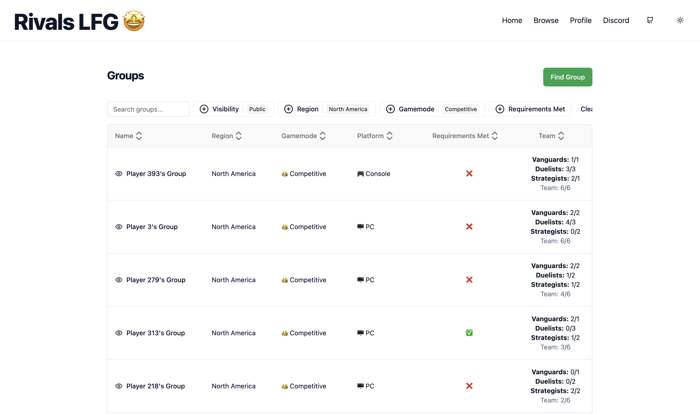
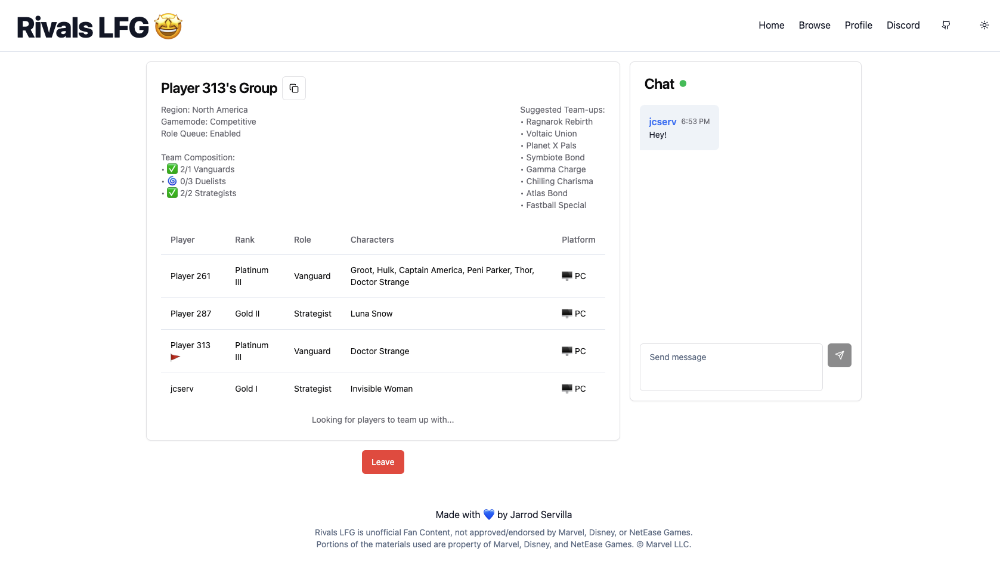

# rivalslfg.com

rivalslfg.com is a matchmaking platform for Marvel Rivals players, enabling group formation based on rank, region, platform, and other preferences (notably providing role queue as an option).

## features ✨

- find groups matching your preferences (rank, region, gamemode)
- create/join groups with role-based matchmaking
- real-time group chat & group updates
- team composition suggestions
- public/private groups with passcode protection

## running locally 🏃‍♂️

See the respective READMEs in the [backend](backend/README.md) and [frontend](frontend/README.md) folders.

## tech stack ⚙️
- frontend
  - react + typeScript + vite
  - tanstack router + react query
  - tailwind + shadcn/ui
- backend
  - golang
  - postgreSQL
  - redis (pub/sub)
  - websockets

## author's note ✍️

ultimately, i ended up not launching since the discourse in the Marvel Rivals community around role queue changed - but this was a fun project to learn about websockets, redis, and sqlc.